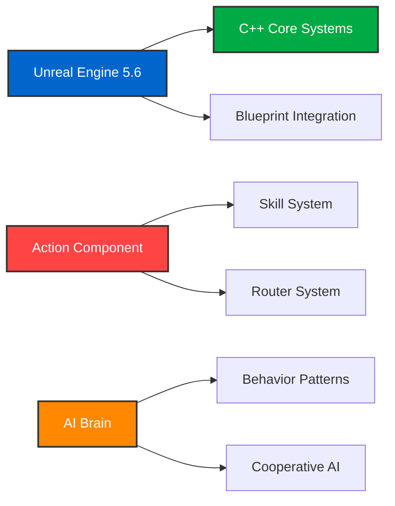

# InfinityShooting
## ✓ Project Overview
<div align="center">

<table border="0" cellspacing="0" cellpadding="8" style="width: 100%; table-layout: fixed;">
  <tr>
    <td style="width: 20%; padding: 8px;"><strong>Project Name</strong></td>
    <td style="padding: 8px;">InfinityFighter - 마블 히어로 배틀 시뮬레이터</td>
  </tr>
  <tr>
    <td style="padding: 8px;"><strong>Duration</strong></td>
    <td style="padding: 8px;">2025.09.08 ~ 2025.09.24</td>
  </tr>
  <tr>
    <td style="padding: 8px;"><strong>Team Size</strong></td>
    <td style="padding: 8px;">3인</td>
  </tr>
  <tr>
    <td style="padding: 8px;"><strong>Engine</strong></td>
    <td style="padding: 8px;">Unreal Engine 5.6</td>
  </tr>
  <tr>
    <td style="padding: 8px;"><strong>Language</strong></td>
    <td style="padding: 8px;">C++ & Blueprint</td>
  </tr>
  <tr>
    <td style="padding: 8px;"><strong>Version Control</strong></td>
    <td style="padding: 8px;">Git-based collaborative workflow</td>
  </tr>
  <tr>
    <td style="padding: 8px;"><strong>Purpose</strong></td>
    <td style="padding: 8px;">UE5 C++ 기반 액션 게임 개발 프로젝트</td>
  </tr>
</table>

</div>

## ✓ Tool & Skill
<div align="center">

  ### Game Development
  
  
  

  ### Version Control
  

</div>

### Commit Guidelines
```
feat: 새로운 기능 추가
fix: 버그 수정
refactor: 코드 리팩토링
docs: 문서 업데이트
style: 코드 스타일 변경
```

## ✓ Technical Architecture

<div align="center">

### Core Technologies

</div>

## ✓ Play
<br>

[시연 영상🔗](https://drive.google.com/file/d/10M_CN8pmrWdWcnFWV2D6hW02CXI8klad/view?usp=drive_link)  

<div align="center" style="width:100%; margin:0;">
  <a href="add/infinity.mp4" title="전체 영상 보기" style="display:block; width:100%;">
    
  </a>
</div>
<hr style="margin:16px 0; border:none; border-top:1px solid #e5e7eb;">


## Development Summary (Prototype → Alpha → Beta)

| 구분 | 프로토타입 (2025-09-15) | 알파 (2025-09-19) | 베타 (2025-09-24) |
|---|---|---|---|
| **핵심 구현** | <ol><li>CharacterBase, Spawn 파이프라인</li><li>GameMode 리스폰</li><li>ActionComponent 스켈레톤</li></ol> | <ol><li>캐릭터 3종 스킬(스파이더맨 웹스윙·벽붙기, 아이언맨 비행·리펄서, 닥스 마법진·투사체)</li><li>쿨타임 시스템</li><li>랜덤 리스폰</li><li>FOV(시야각) 타겟팅</li></ol> | <ol><li>밸런싱(닥터 스트레인지 HP 상향)</li><li>죽음·데미지 애니메이션</li><li>스킬 카메라 전환</li><li>배틀 매니저(게임 상태)</li><li>킬로그(실시간 수집)</li><li>AI 협력 패턴</li></ol> |
| **구조(Architecture)** | <ol><li>코어 모듈 골격</li><li>입력·액션 분리 초안</li></ol> | <ol><li>AI Brain FSM v1~3</li><li>Action Router 확립</li><li>데이터 구동 설계 도입</li></ol> | <ol><li><code>aiBrainComponent</code> 분리</li><li>쿨다운 안정화</li><li>로그·메모리 최적화</li><li>안정성 향상</li></ol> |
| **Flow<br>(UI/게임 진행)** | <ol><li>기본 UI 레이아웃</li></ol> | <ol><li>Lobby</li><li>AimEnemy</li><li>크로스헤어</li><li>맵 전환</li></ol> | <ol><li>Intro → Plaza → Lobby → Ingame 완성</li><li>스킬셋 위젯 정리</li><li>HP UI 정리</li><li>엔딩 씬</li><li>걷기·공격 SFX</li></ol> |


## ✓ KPT 회고 (Keep-Problem-Try)

<div style="width:100%; overflow-x:auto; -webkit-overflow-scrolling:touch;">
<table border="0" cellspacing="0" cellpadding="12"
  style="width:100%; max-width:100%; border-collapse:collapse; font-family:sans-serif; table-layout:auto;">
  <!-- KEEP -->
  <tr><td style="background-color:#e8f5e8; border:1px solid #cfe9cf;"><strong>🟢 KEEP</strong></td></tr>
  <tr>
    <td style="background-color:#f8fff8; border:1px solid #cfe9cf; overflow-wrap:anywhere; word-break:break-word;">
      <ul style="margin:0.5em 0 0 1.2em;">
        <li><strong>소통문화</strong> — 각자 작업해도 디스코드 상주로 실시간 소통/협업</li>
        <li><strong>즉각 피드백 & 집단지성</strong> — 빠른 리뷰로 문제 해결 및 방향 정렬</li>
        <li><strong>긍정적 태도/도전정신 유지</strong> — 어려운 기술적 도전에도 포기하지 않는 자세</li>
        <li><strong>스크럼 운영</strong> — 개인 개발 내용 중심 진행 상황 공유</li>
        <li><strong>상호 스킬업</strong> — 원하는 영역 페어링/스터디로 실력 향상</li>
        <li><strong>팀 케미</strong> — 조화·화합·사랑·우정 🌟</li>
        <li><strong>AI 적극 활용</strong> — 애니메이션 타겟팅, 음악, 캐릭터 생성/보정 등 파이프라인에 AI 도입</li>
      </ul>
    </td>
  </tr>

  
  <!-- PROBLEM -->
  <tr><td style="background-color:#fff2e8; border:1px solid #f0d6c5;"><strong>🟡 PROBLEM</strong></td></tr>
  <tr>
    <td style="background-color:#fffaf5; border:1px solid #f0d6c5; overflow-wrap:anywhere; word-break:break-word;">
      <ul style="margin:0.5em 0 0 1.2em;">
        <li><strong>기간 부족으로 기능 범위 대비 완성도 낮음</strong> — 야심찬 계획 대비 시간 부족으로 품질 저하</li>
        <li><strong>디벨롭 미완</strong> — 일부 시스템 구현이 중간 단계에서 멈춤</li>
        <li><strong>빌드/퍼포먼스 미흡</strong>
          <ul style="margin:0.4em 0 0 1.2em;">
            <li>포스트 프로세싱·최적화 미진</li>
            <li>실행 파일 빌드 실패</li>
            <li>메모리 관리 부족</li>
          </ul>
        </li>
      </ul>
    </td>
  </tr>

  <!-- TRY -->
  <tr><td style="background-color:#e8f2ff; border:1px solid #c9daf6;"><strong>🔵 TRY</strong></td></tr>
  <tr>
    <td style="background-color:#f5f8ff; border:1px solid #c9daf6; overflow-wrap:anywhere; word-break:break-word;">
      <ul style="margin:0.5em 0 0 1.2em;">
        <li><strong>멀티플레이</strong> — 서버 연결 및 세션/매치 조인 구현</li>
        <li><strong>캐릭터 선택</strong> — 플레이어 프리셋/스폰 연동 시스템</li>
        <li><strong>버블 시스템 보완</strong> — 충돌/상태 처리 완성도 향상</li>
        <li><strong>파쿠르 추가</strong> — 이동 컴포넌트 확장 및 파쿠르 액션 구현</li>
      </ul>
    </td>
  </tr>
</table>
</div>


