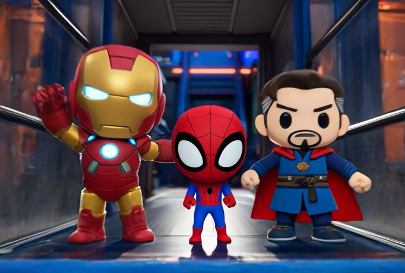

# InfinityFighter

  
  
  <h3></h3>

  
  
  

 

버블파이터를 오마주한 마블 히어로 배틀 시뮬레이터 프로젝트 
Unreal Engine 5.6 기반으로 멀티플레이 전투, FSM 기반 AI, 인게임 UI, 게임 모드 흐름 제어를 중심으로 설계 
캐릭터별 전투 스킬과 물리 기반 상호작용을 구현

## ✓ 프로젝트 개요

<table border="0" cellspacing="0" cellpadding="8" style="width: 100%; table-layout: fixed;">
  <tr>
    <td style="width: 20%; padding: 8px;"><strong>Project Name</strong></td>
    <td style="padding: 8px;">InfinityFighter</td>
  </tr>
  <tr>
    <td style="padding: 8px;"><strong>Duration</strong></td>
    <td style="padding: 8px;">2025.09</td>
  </tr>
  <tr>
    <td style="padding: 8px;"><strong>Team Size</strong></td>
    <td style="padding: 8px;">3명</td>
  </tr>
  <tr>
    <td style="padding: 8px;"><strong>Engine</strong></td>
    <td style="padding: 8px;">Unreal Engine 5.6</td>
  </tr>
  <tr>
    <td style="padding: 8px;"><strong>Tech</strong></td>
    <td style="padding: 8px;">C++ / FSM / Physical / UMG / Android /Steam Server</td>
  </tr>
   <tr>
    <td style="padding: 8px;"><strong>시연 영상</strong></td>
    <td style="padding: 8px;">[InfinityFighter](https://youtu.be/wRN-vNVbVC8?si=RwqurBEoky6E92Ew)</td>
  </tr>
  <tr>
    <td style="padding: 8px;"><strong>Purpose</strong></td>
    <td style="padding: 8px;">멀티플레이 전투와 FSM 기반 AI를 결합한 액션 전투 경험 구현</td>
  </tr>
</table>

---
  ## 핵심 성과 요약
  
  %20→%20O(1)-brightgreen)
  
  
  
  
  - 자료구조 개선 → 성능 최적화 (O(n) → O(1))  
  - FSM + 수학 기반 이동 → 전투 다양성 확보  
  - 서버 권한 구조 → 치트 방지 및 판정 신뢰성 확보  
  - 이벤트 기반 설계 → 유지보수성과 확장성 향상  
  - 물리 기반 전투 스킬 시스템 구현 (충돌, 임펄스, 상호작용 포함)
  - Sin/Cos 기반 이동 로직을 통해 예측 불가능한 전투 패턴 구현
  - FSM 구조 기반으로 유지보수 및 기능 확장 비용 감소
  - AI 활용 모션캡처 및 애니메이션, Asset 적용
  - FSM 기반 AI 시스템 설계 및 구현
  - 5상태(Idle / Move / Attack / Damage / Die) 구조로 AI 상태 전환 관리
  - 3가지 이동 패턴(Chaotic / Strafing Jump / Cover + Attack) 순환 구조 구현
  - 복합 삼각함수 기반 변칙 이동 로직으로 예측하기 어려운 전투 패턴 구현
  - 게임 모드 중심의 전체 플레이 흐름 제어
  - 스폰, 리스폰, 타이머, 맵 전환까지 전투 루프 전체 관리

 

## 문제 해결

---

### 1. 자료구조 개선

<table style="width:100%; min-width:900px; table-layout:fixed; border-collapse:collapse;">
<tr>
<th style="width:25%; padding:12px;">🚨 Problem</th>
<th style="width:25%; padding:12px;">🧠 Approach</th>
<th style="width:25%; padding:12px;">⚙️ Action</th>
<th style="width:25%; padding:12px;">📊 Result</th>
</tr>

<tr>
<td style="padding:12px; vertical-align:top;">킬 로그 문자열 누적 구조</td>
<td style="padding:12px; vertical-align:top;">로그/통계 분리 필요 대안: 문자열 파싱 O(n)</td>
<td style="padding:12px; vertical-align:top;">TArray + TMap 분리 최근 N개 제한</td>
<td style="padding:12px; vertical-align:top;">O(1) 조회 메모리 제한 Before → After 개선</td>
</tr>

<tr>
<td style="padding:12px; vertical-align:top;">시간 스냅샷 로직 혼합</td>
<td style="padding:12px; vertical-align:top;">책임 분리 필요 대안: 단일 함수</td>
<td style="padding:12px; vertical-align:top;">PushSnapshot 구조 TDeque FIFO</td>
<td style="padding:12px; vertical-align:top;">안정성 향상 구조 일관성 확보</td>
</tr>

</table>

---

### 2. AI & 플레이 경험 개선

<table style="width:100%; min-width:900px; table-layout:fixed; border-collapse:collapse;">
<tr>
<th style="width:25%; padding:12px;">🚨 Problem</th>
<th style="width:25%; padding:12px;">🧠 Approach</th>
<th style="width:25%; padding:12px;">⚙️ Action</th>
<th style="width:25%; padding:12px;">📊 Result</th>
</tr>

<tr>
<td style="padding:12px; vertical-align:top;">AI 패턴 단일</td>
<td style="padding:12px; vertical-align:top;">FSM 기반 순환 필요 대안: 랜덤 이동</td>
<td style="padding:12px; vertical-align:top;">3패턴 + FSM 조합</td>
<td style="padding:12px; vertical-align:top;">20+ 패턴 확보 전투 다양성 증가</td>
</tr>

<tr>
<td style="padding:12px; vertical-align:top;">직선 이동 AI</td>
<td style="padding:12px; vertical-align:top;">수학 기반 이동 필요 대안: NavMesh</td>
<td style="padding:12px; vertical-align:top;">Sin/Cos 이동</td>
<td style="padding:12px; vertical-align:top;">비선형 이동 구현 예측 난이도 증가</td>
</tr>

</table>

---

### 3. 물리 & 충돌 시스템 개선

<table style="width:100%; min-width:900px; table-layout:fixed; border-collapse:collapse;">
<tr>
<th style="width:25%; padding:12px;">🚨 Problem</th>
<th style="width:25%; padding:12px;">🧠 Approach</th>
<th style="width:25%; padding:12px;">⚙️ Action</th>
<th style="width:25%; padding:12px;">📊 Result</th>
</tr>

<tr>
<td style="padding:12px; vertical-align:top;">충돌 판정 부정확</td>
<td style="padding:12px; vertical-align:top;">기하 알고리즘 필요 대안: overlap</td>
<td style="padding:12px; vertical-align:top;">Dot / Sweep 적용</td>
<td style="padding:12px; vertical-align:top;">충돌 정확도 향상 안정성 증가</td>
</tr>

</table>

---

### 4. 네트워크 & 아키텍처 개선

<table style="width:100%; min-width:900px; table-layout:fixed; border-collapse:collapse;">
<tr>
<th style="width:25%; padding:12px;">🚨 Problem</th>
<th style="width:25%; padding:12px;">🧠 Approach</th>
<th style="width:25%; padding:12px;">⚙️ Action</th>
<th style="width:25%; padding:12px;">📊 Result</th>
</tr>

<tr>
<td style="padding:12px; vertical-align:top;">서버 단일 구조</td>
<td style="padding:12px; vertical-align:top;">역할 분리 필요 대안: 통합 서버</td>
<td style="padding:12px; vertical-align:top;">Auth + Game Server</td>
<td style="padding:12px; vertical-align:top;">3계층 구조 확보 확장성 증가</td>
</tr>

<tr>
<td style="padding:12px; vertical-align:top;">클라이언트 판정</td>
<td style="padding:12px; vertical-align:top;">서버 권한 필요 대안: 클라 신뢰</td>
<td style="padding:12px; vertical-align:top;">Server authoritative</td>
<td style="padding:12px; vertical-align:top;">치트 방지 신뢰성 확보</td>
</tr>

</table>

 

  ## 역할 및 기여도

  - 총 기여도: 약 45%
  - 구현 책임: 본인 담당 영역 단독 구현

  ### 담당 범위

  - 아이언맨 구현
  - 스파이더맨 구현
  - AI 시스템 총괄
  - 인게임 시스템 구현

  ### 상세 기여

  - FSM 기반 AI 시스템 총괄
  - 움직임, 스킬, 패턴 전환을 포함한 Enemy AI 로직 설계 및 구현
  - 3가지 이동 패턴 순환 구조와 상태 기반 전투 행동 구현
  - 게임 모드 및 전투 흐름 제어
  - 스폰, 타이머, 맵 전환, 리스폰 보호 로직 구현
  - 인게임 UI 통합
  - 타이머, 킬로그, Aim/AimEnemy, 카메라 제어 UI 구성
  - 전투 정보 시각화 및 디버깅 UI 구현
  - 아이언맨, 스파이더맨 캐릭터 스킬 구현
  - AI 협동 공격 트리거 및 전투 상호작용 로직 구현

  ### 타 팀원 담당

  - 닥터 스트레인지
  - 아웃게임 시스템

---

## ✓ 한 줄 요약
멀티플레이 전투 시스템에서 성능, 구조, 플레이 경험을 동시에 개선한 프로젝트

