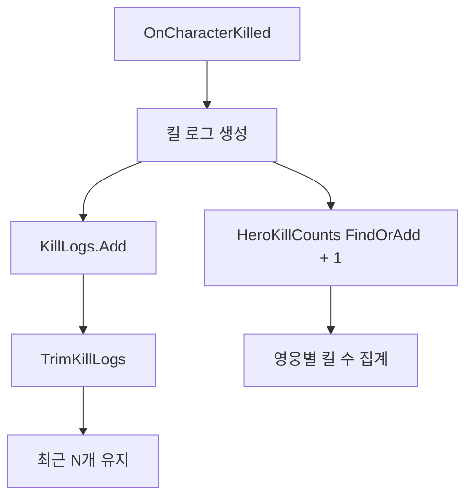
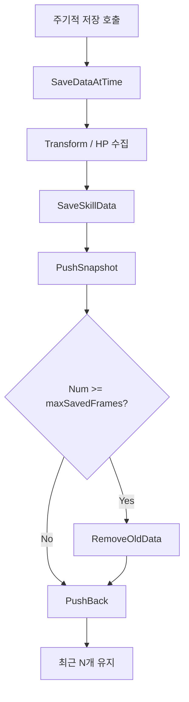
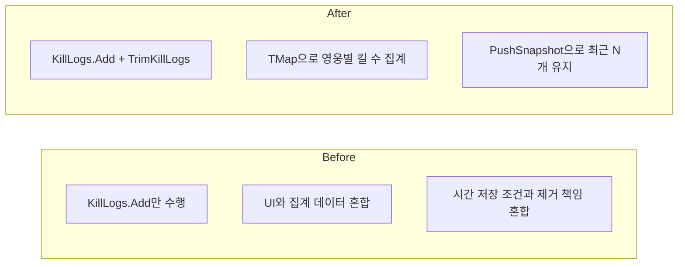

# Infinity 기존 구현의 자료구조 사용 개선

## 개요

이 문서는 기존 Unreal 구현에서 자료구조를 더 적절하게 쓰도록 개선한 내용을 정리한 메모입니다. 특히 1주차 구현에서 확인된 두 가지 지점을 중심으로 정리했습니다.

대상은 다음과 같습니다.

1. `03/26 킬 로그 + 통계 처리`
2. `03/27 닥터 스트레인지 시간 저장 구조`

관련 소스 파일:

- `Source/InfinityFighter/BattleManager.h`
- `Source/InfinityFighter/BattleManager.cpp`
- `Source/InfinityFighter/Public/Chatacter/MyDoctorStrange.h`
- `Source/InfinityFighter/Private/Chatacter/MyDoctorStrange.cpp`

---

## 1. 킬 로그와 킬 수 집계

### 대상 클래스
- `ABattleManager`

### 문제점
기존 구현은 킬 로그를 `TArray<FString> KillLogs`에 계속 `Add`하는 구조였습니다.

이 방식의 문제:

- 최근 로그 몇 개만 필요해도 배열이 계속 커질 수 있습니다.
- UI에서 필요한 정보와 통계 계산용 데이터가 문자열 하나에 섞여 있습니다.
- 특정 영웅의 킬 수 같은 집계 정보를 다시 계산하려면 로그 문자열을 재해석해야 합니다.

### 기존 방식

```cpp
// BattleManager.h
UPROPERTY(VisibleAnywhere, BlueprintReadOnly, Category="Battle", meta=(AllowPrivateAccess="true"))
TArray<FString> KillLogs;
```

```cpp
// BattleManager.cpp
const FString Line = FString::Printf(TEXT("[%s] %s -> %s  (K:%d D:%d)"), TeamTag, *KillerName, *VictimName, KillerKills, KillerDeaths);
KillLogs.Add(Line);
```

### 개선 방식

```cpp
// BattleManager.h
UFUNCTION(BlueprintPure, Category="Battle|Query")
const TArray<FString>& GetRecentKillLogs() const { return KillLogs; }

UFUNCTION(BlueprintPure, Category="Battle|Query")
int32 GetHeroKillCount(FName HeroNickname) const;

TArray<FString> KillLogs;
TMap<FName, int32> HeroKillCounts;
int32 MaxKillLogs = 5;
```

```cpp
// BattleManager.cpp
KillLogs.Add(Line);
TrimKillLogs();

if (!KillerName.IsEmpty() && KillerName != TEXT("<Unknown>"))
{
    const FName KillerKey(*KillerName);
    HeroKillCounts.FindOrAdd(KillerKey)++;
}
```

```cpp
void ABattleManager::TrimKillLogs()
{
    while (KillLogs.Num() > MaxKillLogs)
    {
        KillLogs.RemoveAt(0);
    }
}
```

### 개선 효과

- `KillLogs`는 최근 N개만 유지하도록 제한할 수 있습니다.
- UI 표시는 `KillLogs`로 처리하고, 집계는 `HeroKillCounts`로 분리할 수 있습니다.
- MVP 계산, 킬 랭킹, 후반 통계 화면 확장 시 재사용이 쉬워집니다.

### 자료구조 선택 이유

- `TArray`
  - 최근 로그 목록처럼 순서가 중요한 데이터에 적합합니다.
- `TMap`
  - `영웅 이름 -> 킬 수`처럼 키 기반 집계에 적합합니다.

### 흐름



---

## 2. 닥터 스트레인지 시간 저장 구조

### 대상 클래스
- `AMyDoctorStrange`

### 문제점
기존 구현은 시간 역행용 스냅샷을 `TDeque<FDoctorStrangeSkillSaveData>`에 저장하면서도, 저장 조건과 최대 개수 제한 처리 흐름이 분산되어 있었습니다.

기존 흐름의 문제:

- 최대 저장 개수 조건이 애매해 마지막 한 칸이 비는 식의 동작이 생길 수 있습니다.
- 오래된 데이터를 제거하는 책임과 새 데이터를 넣는 책임이 한 함수 안에 섞여 있습니다.
- `SaveDataAtTime`가 너무 많은 판단을 맡고 있어 읽기 어렵습니다.

### 기존 방식

```cpp
void AMyDoctorStrange::SaveDataAtTime()
{
    if (CanSaveTime)
    {
        if (timeDatas.Num()<= maxSavedFrames)
        {
            FTransform saveTransform = GetActorTransform();
            int32 saveHP = ActionStatComp->Get_CurrentHp();
            SaveSkillData(saveTransform,saveHP);
            return;
        }
    }
    
    RemoveOldData();
}
```

```cpp
void AMyDoctorStrange::SaveSkillData(FTransform PastTransform, int32 pastHp)
{
    FDoctorStrangeSkillSaveData saveData;
    saveData.PastTransform = PastTransform;
    saveData.SavedHp=pastHp;
    timeDatas.PushBack(saveData);
}
```

### 개선 방식

```cpp
void AMyDoctorStrange::SaveDataAtTime()
{
    if (!CanSaveTime || !ActionStatComp)
    {
        return;
    }

    FTransform saveTransform = GetActorTransform();
    int32 saveHP = ActionStatComp->Get_CurrentHp();
    SaveSkillData(saveTransform,saveHP);
}
```

```cpp
void AMyDoctorStrange::SaveSkillData(FTransform PastTransform, int32 pastHp)
{
    FDoctorStrangeSkillSaveData saveData;
    saveData.PastTransform = PastTransform;
    saveData.SavedHp=pastHp;
    PushSnapshot(saveData);
}
```

```cpp
void AMyDoctorStrange::PushSnapshot(const FDoctorStrangeSkillSaveData& SaveData)
{
    if (maxSavedFrames <= 0)
    {
        return;
    }

    while (timeDatas.Num() >= maxSavedFrames)
    {
        RemoveOldData();
    }

    timeDatas.PushBack(SaveData);
}
```

### 개선 효과

- 저장 가능 여부 판단과 저장소 관리 책임을 분리할 수 있습니다.
- 최대 저장 개수를 초과하지 않도록 일관되게 제어할 수 있습니다.
- 이후 저장 대상이 Transform, HP 외에 스킬 상태나 위치 정보로 늘어나도 확장하기 쉽습니다.

### 자료구조 선택 이유

- `TDeque`
  - 앞에서 오래된 데이터를 빼고 뒤에 새 데이터를 넣는 구조에 적합합니다.
  - "최근 N개 스냅샷 유지" 패턴과 잘 맞습니다.

### 흐름



---

## 비교 요약



---

## 결론

이번 정리는 1주차 구현에서 보였던 Unreal 자료구조 사용 방식을 조금 더 명확한 책임 단위로 나눈 것입니다.

- `킬 로그 + 통계 처리`는 `BattleManager`에서 최근 로그와 집계 데이터를 분리하는 방향으로 개선했습니다.
- `시간 저장 구조`는 `MyDoctorStrange`에서 스냅샷 저장 책임을 별도 함수로 분리해 유지보수를 쉽게 만들었습니다.

다음 단계에서는 문자열 중심 로그를 구조체 기반 이벤트로 바꾸고, 스냅샷 데이터도 필요한 게임 상태를 더 안정적으로 포함하도록 확장할 수 있습니다.
