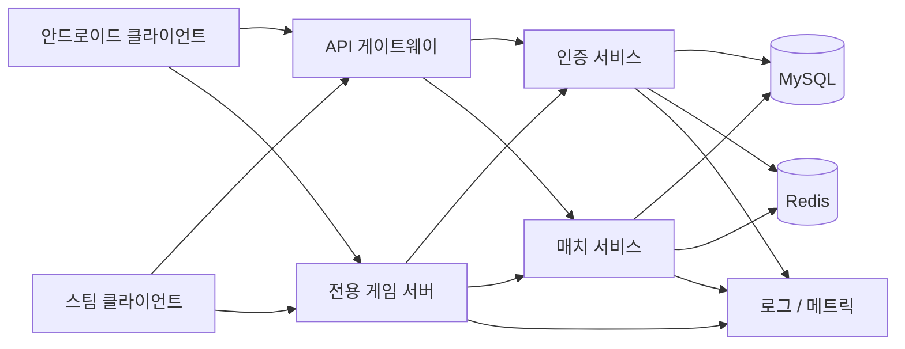
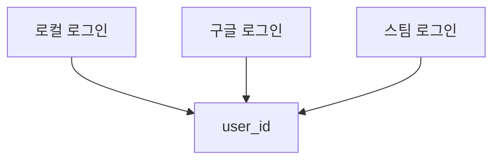
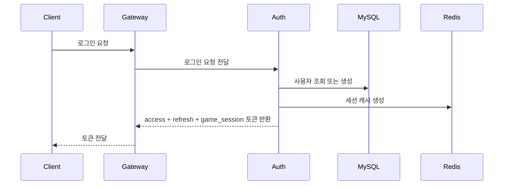
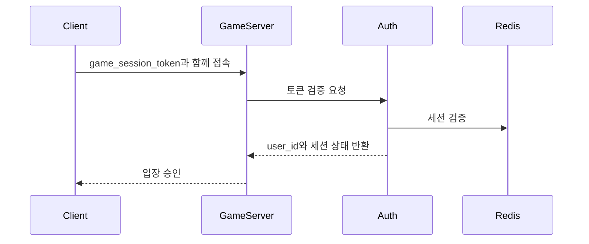
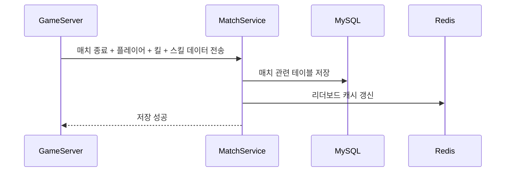

# Infinity 운영형 아키텍처 v2

## 목표

다음 구성 요소를 기준으로 운영 환경에 가까운 아키텍처를 설계합니다.

- 안드로이드 클라이언트
- 스팀 클라이언트
- 전용 게임 서버
- 인증/API 서버
- MySQL
- Redis

필수 요구사항은 다음과 같습니다.

- 로컬 로그인
- Google 로그인
- Steam 로그인
- 하나의 내부 `user_id` 기준 계정 연동
- 권한 기반 전용 서버 구조
- 장기 유지보수가 쉬운 구조
- 명확한 모듈 경계

---

## 최종 구성



이 구조는 다음과 같은 방식보다 실제 운영 환경에 훨씬 가깝습니다.

- `클라이언트 -> 게임 서버 -> DB 직접 접근`
- `게임 서버가 OAuth를 직접 처리`
- `모든 API 도메인이 하나의 거대한 모듈에 섞여 있는 구조`

---

## 서비스 경계

## 1. API 게이트웨이

역할:

- 외부 공개 진입점
- 라우팅
- TLS 종료
- 요청 수 제한
- 기본 요청 검증

필요한 이유:

- 인증 서비스와 매치 서비스를 외부에 직접 노출하지 않음
- 보안 정책 관리가 쉬워짐

---

## 2. 인증 서비스

역할:

- 회원가입
- 로컬 로그인
- Google OAuth 로그인
- Steam 로그인
- 계정 연동
- 토큰 발급 / 재발급 / 폐기
- 게임 서버용 세션 검증

반드시 담당해야 하는 영역:

- 사용자 식별 도메인
- 세션 도메인
- 외부 로그인 제공자 매핑

담당하면 안 되는 영역:

- 매치 결과 계산
- 킬 / 데스 판정 로직

---

## 3. 매치 서비스

역할:

- 매치 메타데이터 생성 / 종료
- 매치 결과 저장
- 킬 이벤트 저장
- 스킬 이벤트 저장
- 사용자 통계 생성
- 랭킹 / 리더보드 스냅샷 생성

반드시 담당해야 하는 영역:

- 매치 영속화
- 통계 집계

담당하면 안 되는 영역:

- OAuth 로그인
- 비밀번호 관리

---

## 4. 전용 게임 서버

역할:

- 로비 -> 매치 -> 결과 상태 머신
- 스폰
- 리스폰
- HP 판정 권한
- 킬 판정 권한
- 투사체 판정 권한
- 스킬 결과 판정 권한
- 매치 타이머 권한

반드시 해야 하는 일:

- 인증 서비스를 통해 게임 세션 토큰 검증
- 최종 매치 결과를 매치 서비스로 전송

하면 안 되는 일:

- 핵심 경로에서 비즈니스 데이터를 MySQL에 직접 저장
- Google / Steam 로그인을 자체 구현

---

## 계정 식별 모델

모든 로그인 방식은 하나의 내부 사용자 ID로 귀결되어야 합니다.



권장 테이블:

- `users`
- `user_identities`
- `user_sessions`

예시:

- 한 사용자는 로컬 계정, 구글 계정, 스팀 계정을 함께 가질 수 있습니다.

이 구조의 의미:

- 안드로이드와 스팀에서 동일한 통계를 공유할 수 있음
- 같은 계정을 여러 로그인 제공자로 사용할 수 있음
- 이후 Apple 로그인을 추가해도 게임 도메인 로직을 바꾸지 않아도 됨

---

## 토큰 모델

토큰은 세 종류로 나누는 것이 좋습니다.

## 1. 액세스 토큰

- 수명이 짧음
- 클라이언트의 API 호출에 사용
- 15분에서 30분

## 2. 리프레시 토큰

- 수명이 김
- 새 액세스 토큰 발급에만 사용
- 7일에서 30일
- DB에는 해시 형태로 저장

## 3. 게임 세션 토큰

- 인증 성공 후 발급
- 수명이 짧음
- 전용 서버 접속 시에만 사용
- 포함 정보:
- `user_id`
- `session_id`
- `nickname`
- `issued_at`
- `expires_at`

게임 토큰을 분리하는 이유:

- 게임 서버에는 게임에 필요한 안전한 정보만 전달하면 됨
- 게임 토큰이 유출되더라도 영향 범위를 줄일 수 있음
- 매치 참여 티켓을 무효화하기 쉬움

---

## 로그인 흐름



---

## 게임 입장 흐름



---

## 매치 종료 흐름



---

## Redis 사용 방식

Redis는 최종 진실 저장소가 아닙니다.

MySQL = 기준 데이터 저장소  
Redis = 속도 계층

Redis 사용 대상:

- 세션 캐시
- 게임 토큰 블랙리스트 / 폐기 캐시
- 리더보드 캐시
- 매치 요약 캐시
- 요청 수 제한
- 짧은 수명의 입장 티켓

권장 키 패턴:

```text
session:{sessionId}
user:sessions:{userId}
leaderboard:season:{seasonId}
match:summary:{matchId}
auth:blacklist:{tokenId}
join:ticket:{ticketId}
```

TTL 예시:

- `join:ticket:*` -> 1분에서 5분
- `session:*` -> 리프레시 토큰 수명 또는 더 짧은 활성 세션 캐시
- `match:summary:*` -> 10분에서 60분
- `leaderboard:*` -> 몇 초 또는 몇 분 간격으로 재생성

---

## MySQL 역할

MySQL에는 다음 데이터를 저장합니다.

- users
- identities
- sessions
- matches
- match_players
- kill_events
- skill_events
- daily stats
- season stats

중요 원칙:

- Redis를 최종 통계 저장소로 사용하지 않음
- 최종 랭킹과 분석 데이터는 MySQL만으로 다시 만들 수 있어야 함

---

## 내부 모듈 설계

인증 서비스는 내부적으로 다음과 같이 나누는 것이 좋습니다.

```text
AuthService/
  Controller/
  Application/
  Domain/
  Infrastructure/
  Provider/
  Security/
```

권장 하위 모듈:

- `Identity`
- `Session`
- `Token`
- `Provider.Google`
- `Provider.Steam`
- `Provider.Local`

매치 서비스도 같은 방식으로 나누는 것이 좋습니다.

```text
MatchService/
  Controller/
  Application/
  Domain/
  Infrastructure/
  Batch/
  Cache/
```

권장 하위 모듈:

- `MatchLifecycle`
- `MatchResult`
- `KillEvent`
- `SkillEvent`
- `StatsAggregation`
- `Leaderboard`

이런 분리는 유지보수 측면에서 중요합니다.

- 인증 버그는 인증 도메인 안에 머물도록
- 매치 버그는 매치 도메인 안에 머물도록
- DB 저장소 변경이 컨트롤러까지 새지 않도록

---

## 로깅과 운영

최소 네 종류의 로그가 필요합니다.

## 1. 인증 감사 로그

- 로그인 성공
- 로그인 실패
- 리프레시 토큰 발급
- 계정 연결 / 해제

## 2. 게임 세션 로그

- 입장 승인
- 입장 거부
- 연결 종료
- 매치 시작
- 매치 종료

## 3. 매치 이벤트 로그

- 킬 이벤트 수집 결과
- 매치 저장 결과
- 통계 집계 결과

## 4. 오류 로그

- DB 타임아웃
- Redis 타임아웃
- 토큰 검증 실패
- 외부 제공자 API 실패

추적할 메트릭:

- 로그인 성공률
- 토큰 검증 지연 시간
- 매치 종료 저장 지연 시간
- 킬 이벤트 배치 크기
- Redis 적중률
- DB 질의 지연 시간

---

## 배치와 캐시 전략

이벤트 양이 늘어나면 게임 서버에서 모든 이벤트를 MySQL에 동기식으로 바로 넣지 않는 것이 좋습니다.

권장 방식:

- 게임 서버는 매치 동안 메모리에 데이터를 누적
- 일정 주기 또는 매치 종료 시점에 배치 전송
- 매치 서비스는 트랜잭션 단위 배치 저장
- 집계 작업이 일간 / 시즌 통계를 갱신

적절한 배치 단위:

- 하나의 매치 결과 배치
- 하나의 킬 이벤트 배치
- 하나의 스킬 이벤트 배치

장점:

- DB 왕복 횟수 감소
- 재시도 처리 단순화
- 락 경쟁 감소
- 분석 파이프라인 확장 용이

---

## 플랫폼 지원 고려사항

안드로이드:

- Google 로그인이 주요 소셜 로그인
- 이후 게스트 계정에서 정식 계정으로 전환 기능을 붙일 수 있음

스팀:

- Steam 로그인이 주요 플랫폼 식별자
- 기존 로컬 / 구글 계정과 연결하는 선택 기능을 둘 수 있음

유지보수를 쉽게 하려면:

- 플랫폼 SDK 로직은 클라이언트와 인증 제공자 어댑터에 둠
- 게임 도메인 로직은 플랫폼별 분기를 깊게 가지지 않음

좋지 않은 방식:

- 게임 서버 안에 `if Android / if Steam` 인증 분기 로직이 있는 구조

좋은 방식:

- 게임 서버는 항상 정규화된 `user_id`만 전달받는 구조

---

## 운영 원칙

1. 클라이언트가 보낸 킬이나 점수를 그대로 신뢰하지 않음
2. 전용 서버가 OAuth 제공자 로직을 소유하지 않음
3. Redis를 유일한 상태 저장소로 사용하지 않음
4. 리프레시 토큰을 평문으로 저장하지 않음
5. 인증 컨트롤러 코드와 매치 저장소 코드를 섞지 않음
6. 내부 API와 공개 API를 분리함

---

## 현재 구조에서의 이전 경로

현재 방향도 이미 나쁘지 않습니다.

- 클라이언트와 인증/API 개념이 분리되어 있음
- 전용 서버 도입 계획이 있음
- MySQL 도입 계획이 있음

운영형 구조에 가까워지기 위한 다음 단계:

1. `InfinityServer`를 `Auth`와 `Match` 모듈로 분리
2. Redis 추가
3. 게임 세션 토큰 흐름 추가
4. 전용 서버용 내부 API 추가
5. 리더보드 캐시 추가
6. 배치 저장 파이프라인 추가
7. 메트릭과 감사 로그 추가

---

## 실무형 권장안

포트폴리오나 첫 운영형 버전 기준으로는 다음이 현실적입니다.

- 배포 프로세스는 처음에는 하나로 유지
- 대신 코드 내부는 다음처럼 분리
- `AuthModule`
- `MatchModule`
- `SharedInfra`

이렇게 하면 다음 장점이 있습니다.

- 배포는 단순함
- 코드 구조는 운영형에 가까움
- 나중에 서비스 분리가 쉬움

다음 요소 사이의 균형이 가장 좋습니다.

- 현실성
- 유지보수성
- 개발 속도

---

## 요약

실제 업계 구조에 가깝게 가져가려면 목표 구조는 다음과 같습니다.

- 공개 `Gateway`
- `Auth Service`
- `Match Service`
- `Dedicated Game Server`
- 기준 저장소인 `MySQL`
- 캐시 / 세션 / 랭킹용 `Redis`
- 명확한 토큰 분리
- 내부 API와 공개 API의 명확한 분리
- 배치 기반 이벤트 저장

이 구조는 안드로이드와 스팀 출시 이후에도 유지보수가 가능하고, 실제 라이브 서비스 아키텍처와도 상당히 가깝습니다.
