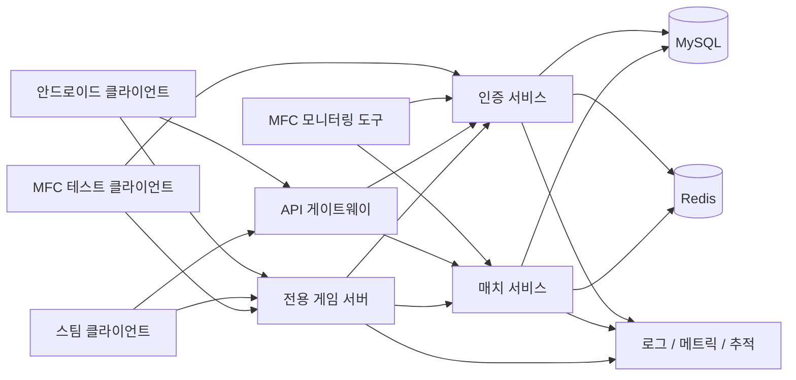
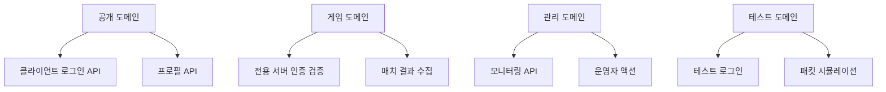
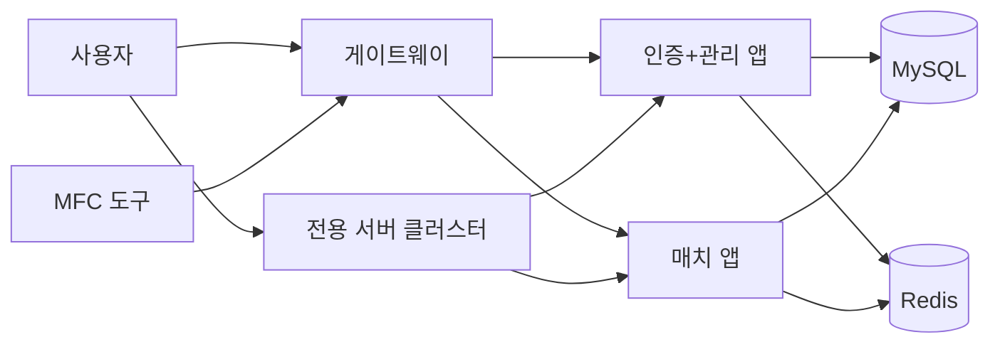

# MFC 운영 도구와 테스트 클라이언트를 포함한 Infinity 운영형 아키텍처 v3

## 목표

이전 운영형 아키텍처를 확장해 다음 요소까지 지원하는 구조를 정의합니다.

- 안드로이드 클라이언트
- 스팀 클라이언트
- 전용 게임 서버
- 인증 서비스
- 매치 서비스
- MySQL
- Redis
- MFC 모니터링 도구
- 서버 통합 테스트용 MFC 테스트 클라이언트

이 버전은 실제 멀티플레이 게임 운영팀의 구조에 더 가깝습니다.

- 실제 유저가 사용하는 게임 클라이언트
- 권한 기반 판정을 수행하는 전용 서버
- 운영자와 QA가 사용하는 내부 도구
- 프로토콜 검증과 부하 확인을 위한 별도 테스트 클라이언트

---

## 최종 구성



---

## 실무에서 MFC 도구가 존재하는 이유

일부 게임 백엔드와 내부 툴 환경에서는 지금도 MFC를 사용하는 경우가 있습니다. 이유는 다음과 같습니다.

- Windows 기반 내부 도구를 배포하기 쉽습니다.
- QA와 운영자가 브라우저 의존 없이 단일 실행 파일을 사용할 수 있습니다.
- 패킷 테스트와 운영 기능을 데스크톱 도구로 더 빠르게 만들 수 있습니다.

대표적인 내부 사용 사례:

- 라이브 모니터링 대시보드
- GM / 운영자 액션 도구
- 프로토콜 테스트 클라이언트
- 매치 시뮬레이션 도구
- 패킷 재생 도구

---

## 도구 분리 원칙

운영 목적의 기능을 실제 게임 클라이언트에 억지로 넣지 않는 것이 좋습니다.

## 1. MFC 모니터링 도구

목적:

- 운영 가시성 확보
- 실시간 상태 점검
- 플레이어 조회
- 매치 조회
- 세션 조회
- 큐 / 서버 상태 확인

연결 대상:

- 인증 서비스의 관리자 엔드포인트
- 매치 서비스의 관리자 엔드포인트
- 메트릭 엔드포인트

하면 안 되는 일:

- 일반 모니터링을 위해 가짜 게임 클라이언트처럼 접속
- 운영 환경에서 MySQL에 직접 접근

## 2. MFC 테스트 클라이언트

목적:

- 패킷 수준 프로토콜 검증
- 로그인 연동 테스트
- 전용 서버 접속 테스트
- 재접속 시나리오 검증
- 반복 가능한 매치 흐름 시뮬레이션

연결 대상:

- 공개 로그인 엔드포인트
- 전용 게임 서버 프로토콜

하면 안 되는 일:

- 실제 게임 플레이 QA를 완전히 대체
- 명시적 승인 없이 운영 전용 관리자 API 호출

---

## 권장 서비스 도메인



이 분리는 중요합니다.

모두 섞어버리면 다음 문제가 생깁니다.

- 운영 위험 증가
- 관리자 인증 구조 복잡화
- 테스트 도구가 권한이 높은 경로를 실수로 사용하게 됨

---

## 인증과 토큰 모델

기존 세 가지 토큰 계층은 그대로 유지합니다.

- 액세스 토큰
- 리프레시 토큰
- 게임 세션 토큰

여기에 내부 도구용 토큰을 하나 더 추가합니다.

- 관리자 세션 토큰

## 관리자 세션 토큰

사용 대상:

- MFC 모니터링 도구
- 내부 대시보드

포함해야 하는 정보:

- 운영자 ID
- 역할
- 권한 목록
- 짧은 만료 시간

MFC 모니터링 도구가 일반 플레이어용 액세스 토큰으로 관리자 API를 호출하게 해서는 안 됩니다.

---

## 권장 API 분리

## 공개 API

안드로이드 / 스팀 클라이언트가 사용합니다.

- `POST /auth/register`
- `POST /auth/login`
- `POST /auth/google/login`
- `POST /auth/steam/login`
- `POST /auth/refresh`
- `GET /me/profile`
- `GET /me/stats`

## 내부 게임 API

전용 서버가 사용합니다.

- `POST /internal/auth/verify-game-token`
- `POST /internal/matches/start`
- `POST /internal/matches/finish`
- `POST /internal/matches/{matchId}/kills/batch`
- `POST /internal/matches/{matchId}/skills/batch`

## 관리자 API

MFC 모니터링 도구가 사용합니다.

- `POST /admin/login`
- `GET /admin/health/services`
- `GET /admin/players/{userId}`
- `GET /admin/matches/{matchId}`
- `GET /admin/sessions/{sessionId}`
- `GET /admin/leaderboard/current`
- `POST /admin/players/{userId}/disconnect`
- `POST /admin/matches/{matchId}/close`

## 테스트 API

선택 사항이며 QA와 MFC 테스트 도구가 사용합니다.

- `POST /test/token/create`
- `POST /test/fake-user/create`
- `POST /test/match/mock-finish`

테스트 API는 엄격한 제어 없이 운영 환경에서 활성화하면 안 됩니다.

---

## 전용 서버의 역할

전용 서버는 계속해서 판정 권한을 가져야 합니다.

담당해야 하는 영역:

- 스폰
- HP 상태
- 킬 판정
- 투사체 결과
- 타이머
- 승패 결과
- 플레이어별 최종 매치 통계

담당하면 안 되는 영역:

- 사용자 회원가입
- 비밀번호 검증
- Google / Steam 인증 검증
- 관리자 정책 처리

---

## 확장된 구성에서의 Redis 활용

MFC 도구가 들어오면 운영자와 테스트 도구가 빠른 조회를 필요로 하므로 Redis의 중요성이 더 커집니다.

Redis 사용 대상:

- 활성 세션 캐시
- 활성 전용 서버 레지스트리
- 실시간 매치 요약 캐시
- 리더보드 캐시
- 요청 수 제한
- 패킷 테스트 상태 캐시

권장 키 패턴:

```text
session:{sessionId}
game_session:{ticketId}
server:active:{serverId}
match:live:{matchId}
leaderboard:season:{seasonId}
admin:session:{adminSessionId}
test:run:{runId}
```

---

## MFC 모니터링 도구 설계

권장 모듈:

```text
MFCMonitoringTool/
  UI/
  ApiClient/
  ViewModel/
  Models/
  Auth/
  Metrics/
  Logs/
```

권장 화면:

- 서비스 상태
- 활성 전용 서버 목록
- 활성 세션 목록
- 현재 매치 목록
- 플레이어 상세
- 매치 상세
- 리더보드 스냅샷
- 오류 로그 뷰어

권장 기능:

- 실시간 화면은 2초에서 5초 간격 자동 새로고침
- `user_id`, `nickname`, `match_id` 기준 수동 검색 / 필터
- 현재 그리드 CSV 내보내기

하지 말아야 할 것:

- 운영 DB를 MFC에서 직접 조회
- 도구 실행 파일에 DB 계정 정보 포함

사용할 것:

- 관리자 API + 관리자 세션 토큰

---

## MFC 테스트 클라이언트 설계

권장 모듈:

```text
MFCTestClient/
  Packet/
  Transport/
  Scenario/
  AuthClient/
  GameClient/
  Logger/
```

권장 시나리오:

- 로컬 로그인 성공 / 실패
- Google 토큰 교환 흐름 모의 테스트
- Steam 토큰 교환 흐름 모의 테스트
- 게임 토큰으로 전용 서버 접속
- 이동 패킷 반복 전송 테스트
- 스킬 패킷 시퀀스 테스트
- 연결 종료 후 재접속
- 여러 가짜 클라이언트의 동일 방 입장

권장 기능:

- 패킷 송수신 로그
- 스크립트 기반 테스트 시나리오 실행기
- 지연 시간 / 타임아웃 설정
- 자동 재접속 테스트
- 단일 프로세스 또는 다중 프로세스 멀티 클라이언트 실행

실무에서 특히 유용한 이유:

- 실제 게임 클라이언트는 프로토콜 디버깅에 너무 무거움
- QA는 재현 가능한 패킷 스크립트가 필요함
- 백엔드 검증을 결정론적 클라이언트로 더 쉽게 수행할 수 있음

---

## 로깅과 운영

최소 다음 로그는 필요합니다.

- 인증 감사 로그
- 게임 이벤트 로그
- 관리자 액션 감사 로그
- 테스트 실행 로그
- 시스템 오류 로그

MFC 모니터링 도구에서 실제 운영 액션을 실행할 수 있게 되면 관리자 액션 감사 로그가 특히 중요합니다.

예시:

- 운영자 X가 플레이어 Y를 강제 종료
- 운영자 X가 매치 Z를 강제 종료
- 운영자 X가 리더보드 캐시를 새로고침

이 기록은 저장되고 검색 가능해야 합니다.

---

## 환경 분리

최소 세 가지 환경을 두는 것이 좋습니다.

- local
- staging
- production

원칙:

- MFC 테스트 클라이언트는 local / staging을 자유롭게 사용
- MFC 모니터링 도구는 관리자 인증을 거쳐 production 조회 가능
- 테스트 API는 local / staging에서만 활성화

절대 섞으면 안 되는 것:

- 운영 관리자 계정을 테스트 클라이언트에 사용
- staging 테스트 엔드포인트를 배포 클라이언트에 포함

---

## 현실적인 운영형 배포 구조

현실적이면서도 관리 가능한 구성을 예로 들면 다음과 같습니다.



작은 규모에서는 다음과 같은 구성이 가능합니다.

- 하나의 `Auth+Admin` 배포본 허용
- 하나의 `Match` 배포본 허용
- 단, 코드 내부 구조는 계속 모듈화

이 방식은 소규모 또는 중간 규모 팀에서 유지보수 균형이 좋은 편입니다.

---

## 왜 실제 업계 구조에 가깝다고 볼 수 있는가

이 설계는 실제 서비스 운영에서 흔히 보이는 요소를 대부분 포함합니다.

- authoritative 전용 서버
- 게임플레이와 분리된 인증 계층
- 다중 로그인 제공자 지원
- 내부 관리자 API 분리
- 운영자 도구 경로
- 프로토콜 테스트 클라이언트 경로
- Redis 캐시 계층
- 관리자 토큰과 감사 로그
- 환경 분리
- 배치 이벤트 저장

따라서 순수 게임 클라이언트 중심 구조보다 실제 운영 환경에 훨씬 가깝습니다.

---

## 최종 권장안

목표가 "운영형에 가깝고 유지보수 가능한 구조"라면 다음 구성이 적절합니다.

- 실제 유저용 Android / Steam 클라이언트
- 게임 판정 권한을 가진 전용 서버
- 사용자 식별을 담당하는 인증 서비스
- 결과 저장과 분석을 담당하는 매치 서비스
- 세션 / 랭킹 / 실시간 캐시용 Redis
- 기준 저장소인 MySQL
- 운영용 MFC 모니터링 도구
- QA와 프로토콜 검증용 MFC 테스트 클라이언트

이 구조는 출시 후에도 유지보수가 가능하고, 면접이나 포트폴리오에서도 현실적인 구조로 설명하기 좋습니다.
