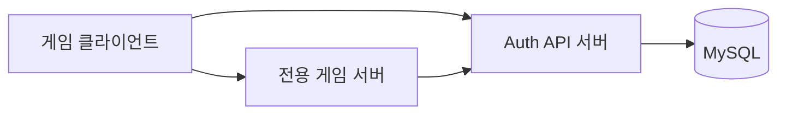
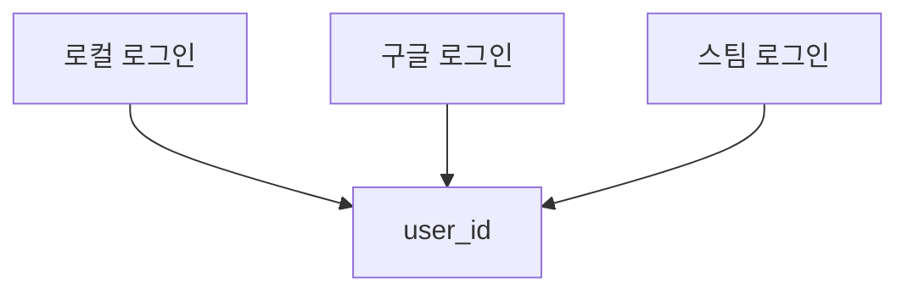
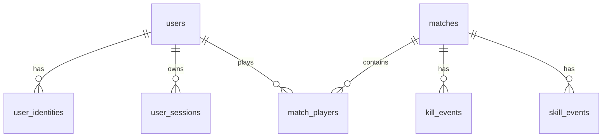
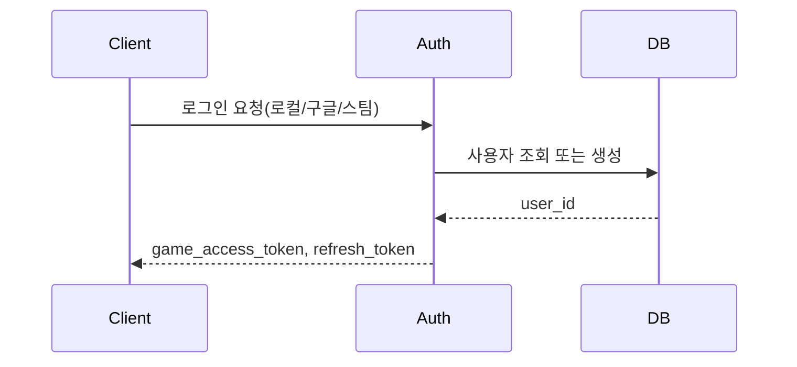
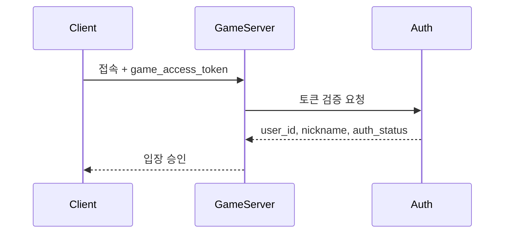
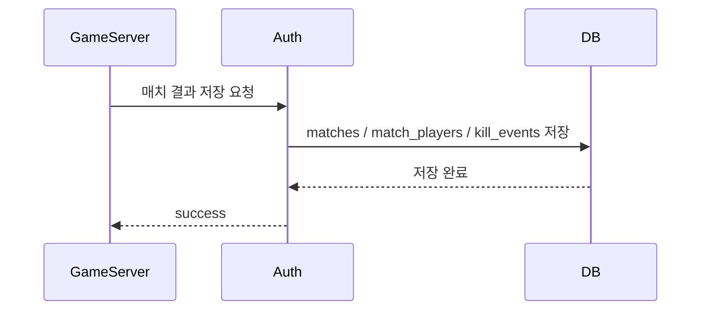

# Infinity 전용 서버 + Auth API + MySQL 구조 초안

## 개요

이 문서는 `Infinity` 프로젝트를 운영형 구조로 확장하기 위한 가장 초기 아키텍처 초안입니다.

- `클라이언트 -> Auth API`
- `클라이언트 -> 전용 게임 서버`
- `전용 게임 서버 -> Auth API -> MySQL`

핵심 방향은 다음과 같습니다.

1. 로그인과 계정 관리는 `Auth API`에서 처리합니다.
2. 실제 게임 판정은 `Dedicated Game Server`가 권한을 가집니다.
3. 게임 서버가 DB에 직접 강하게 결합되지 않도록 `Auth/API Server`를 중간 계층으로 둡니다.
4. 모든 로그인 방식은 최종적으로 하나의 내부 `user_id`에 연결됩니다.

---

## 기본 구조



이 구조의 의도는 다음과 같습니다.

- OAuth, 세션, 계정 관리 같은 인증 책임을 게임 서버에서 분리합니다.
- 게임 서버는 전투와 판정에 집중합니다.
- DB 스키마 변경이 생겨도 API 계층을 통해 완충할 수 있습니다.

---

## 역할 분리

### 1. 클라이언트

역할:

- 로컬 / 구글 / 스팀 로그인 요청
- Auth API를 통해 인증 처리
- 인증 완료 후 전용 서버 접속
- 기본 프로필 조회
- 게임 진행 중 서버 상태에 맞는 입력 전송

하지 말아야 할 일:

- 킬 판정
- 스킬 결과 판정
- 핵심 전투 로직 계산
- 계정 데이터 직접 저장

### 2. Auth API 서버

역할:

- 회원가입
- 로컬 로그인
- Google OAuth 로그인
- Steam 로그인
- 로그인 결과 토큰 발급
- 게임 서버 접속용 토큰 검증
- 전용 서버용 내부 API 제공
- 계정 조회 및 관리 API 제공

### 3. 전용 게임 서버

역할:

- 로비 -> 매치 -> 결과 흐름 관리
- 스폰 / 리스폰
- 킬 판정
- 스킬 결과 판정
- 매치 종료 시 결과 정리
- 필요 시 Auth API에 토큰 검증 요청

### 4. MySQL

역할:

- 사용자 계정 저장
- 로그인 식별 정보 저장
- 세션 / 매치 / 결과 저장
- 플레이어 통계 저장
- 이후 분석용 데이터 저장

---

## 로그인 방식 통합

여러 로그인 방식이 존재하더라도 최종적으로는 모두 `users.id` 하나로 연결되어야 합니다.



이 구조를 쓰면:

- 로컬, 구글, 스팀 로그인 모두 하나의 사용자 통계와 연결됩니다.
- 이후 다른 플랫폼 로그인도 게임 도메인 변경 없이 추가할 수 있습니다.

---

## 권장 DB 테이블

권장 테이블은 다음과 같습니다.

- `users`
- `user_identities`
- `user_sessions`
- `matches`
- `match_players`
- `kill_events`
- `skill_events`
- `player_daily_stats`

ER 관계 예시:



---

## API 구조

### 공개 API

- `POST /auth/register`
- `POST /auth/login`
- `POST /auth/google/login`
- `POST /auth/steam/login`
- `POST /auth/refresh`
- `GET /me/profile`
- `GET /me/stats`

### 전용 서버용 내부 API

- `POST /internal/auth/verify-game-token`
- `POST /internal/matches/start`
- `POST /internal/matches/finish`
- `POST /internal/matches/{matchId}/kills/batch`
- `POST /internal/matches/{matchId}/skills/batch`

원칙:

- 전용 서버용 내부 API는 `internal secret` 또는 mTLS 같은 방식으로 보호해야 합니다.
- 일반 클라이언트는 내부 API를 직접 호출할 수 없어야 합니다.

---

## 주요 흐름

### 로그인



### 전용 서버 입장



### 매치 결과 저장



---

## 전용 서버 구조가 필요한 이유

### 서버가 권한을 가져야 하는 대상

- 스폰
- HP
- 킬 / 데스 판정
- 스킬 결과
- 투사체 결과
- 매치 종료 처리

### 클라이언트 입력은 검증 대상

- 이동 입력
- 스킬 사용 입력
- 공격 요청

### 동기화 대상 상태

- HP
- Kills / Deaths
- Respawn State
- Match State
- Match Timer
- Projectile Spawn Result
- Skill Cooldown State

---

## 초기 구현 단계 제안

### 1. 인증 서버와 전용 서버 분리

이유:

- OAuth 같은 외부 연동 책임을 게임 서버에서 떼어낼 수 있음
- 보안 정책을 더 명확하게 관리할 수 있음
- 계정 기능 확장이 쉬워짐

### 2. DB 접근 계층 분리

권장 구성:

- Repository 계층
- Service 계층
- DTO / Request / Response 분리

효과:

- 기능 추가 시 SQL이 코드 전반에 퍼지는 것을 막을 수 있음
- 게임 로직과 DB 접근이 강하게 결합되지 않음

### 3. 로그인 제공자 추상화

예시 인터페이스:

```text
IIdentityProvider
 - ValidateToken(...)
 - GetProviderUserId(...)
 - GetEmail(...)
 - GetDisplayName(...)
```

구현체 예시:

- `LocalIdentityProvider`
- `GoogleIdentityProvider`
- `SteamIdentityProvider`

### 4. 매치 결과 배치 저장

모든 이벤트를 개별 insert로 처리하면 성능과 유지보수 모두 불리해질 수 있습니다.

권장 방식:

- 매치 종료 시점 기준 결과 집계
- 이벤트는 일정 주기 또는 종료 시점에 flush
- `kills/batch`, `skills/batch` 형태의 저장 API 사용

### 5. 토큰 수명 분리

권장 예시:

- access token: 15~30분
- refresh token: 7~30일

---

## 코드 구조 예시

### Auth/API 서버

```text
InfinityServer/
  src/
    Auth/
      Controller/
      Service/
      Provider/
      DTO/
    Match/
      Controller/
      Service/
      DTO/
    DB/
      Repository/
      Entity/
      Migration/
    Common/
      Config/
      Security/
      Logging/
```

### Unreal 클라이언트 / 게임 코드

```text
Source/InfinityFighter/
  Public/
    Network/
    Match/
    Auth/
  Private/
    Network/
    Match/
    Auth/
```

---

## 단계별 우선순위

### 1단계

- `users`, `user_identities`, `user_sessions` 설계
- 로컬 로그인 구현
- 전용 서버 토큰 검증 설계

### 2단계

- Google 로그인 연동
- Steam 로그인 연동
- 계정 연결 기능 연동

### 3단계

- Dedicated Server 토큰 검증 완료
- 입장 흐름 연동 완료

### 4단계

- 매치 종료 / 결과 저장
- `match_players` 저장
- `kill_events` 저장

### 5단계

- 플레이어 통계 집계
- 리더보드 배치
- 시즌별 매치 결과 정리
- 캐시 / 세션 운영 고도화

---

## 요약

- `클라이언트 / 전용 게임 서버 / Auth API / MySQL` 구조로 나누면 책임이 명확해집니다.
- 로컬 로그인, 구글 로그인, 스팀 로그인 모두 하나의 `user_id`로 연결해야 이후 확장이 쉬워집니다.
- 게임 서버는 authoritative 구조를 유지하고, 인증과 저장은 내부 API를 통해 분리하는 것이 좋습니다.
- 이후 Redis, 배치 저장, 관리자 도구를 추가하면 더 운영형 구조에 가까워질 수 있습니다.

---

## 함께 보면 좋은 문서

- [Auth/MySQL 스키마](/C:/Users/EJ/Desktop/Fork/Infinity/docs/sql/auth_match_schema.sql)
- [이전 구현 자료구조 사용 개선](/C:/Users/EJ/Desktop/Fork/Infinity/docs/algorithms/이전%20구현%20자료구조%20사용%20개선.md)
