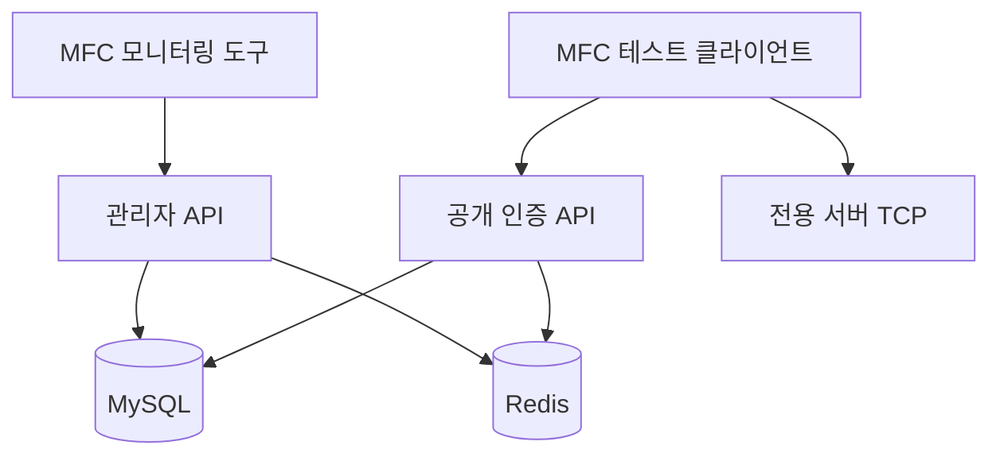

# MFC 모니터링 및 테스트 클라이언트 명세

## 범위
이 문서는 MFC 기반 내부 도구가 운영형 백엔드 구조 안에서 어떤 역할을 가져야 하는지 정의합니다.

## 모니터링 도구

### 목적
- 인증 서버, 매치 서버, 전용 서버 상태를 모니터링합니다.
- DB 직접 접근 없이 플레이어 세션 상태를 조회합니다.
- 감사 가능한 API를 통해 통제된 관리자 작업을 제공합니다.

### 화면 구성
- `클러스터 개요`
  - Auth API 상태
  - 전용 서버 노드 상태
  - Redis 상태
  - MySQL 상태
- `플레이어 세션 조회`
  - 사용자 ID
  - 로그인 제공자
  - 활성 세션 토큰 상태
  - 현재 매치 ID
- `매치 조회`
  - 매치 ID
  - 시작 시각
  - 플레이어 수
  - 승리 팀
  - 결과 저장 상태

## 테스트 클라이언트

### 목적
- 전체 게임 클라이언트 없이 로그인 연동을 검증합니다.
- 패킷 회귀 문제를 빠르게 재현합니다.
- 재접속과 결과 제출 흐름을 반복 검증합니다.

### 핵심 시나리오
- 로컬 로그인
- Google 로그인
- Steam 로그인
- 전용 서버 핸드셰이크
- 리프레시 토큰 기반 재접속
- 매치 결과 제출
- 잘못된 토큰 거부

### 즉시 테스트 가능한 개발 계정
- 로컬 계정: `tester@infinity.local / pass1234`
- 로컬 계정: `operator@infinity.local / admin1234`
- Google 테스트 토큰: provider=`google`, token=`google-dev-token`
- Steam 테스트 토큰: provider=`steam`, token=`steam-dev-ticket`

### 바로 실행 가능한 패킷 테스트 흐름
1. `OP_REGISTER_REQ`로 회원가입
2. `OP_LOGIN_REQ`로 로그인
3. `OP_VALIDATE_GAME_TOKEN_REQ`로 반환된 게임 세션 토큰 검증
4. `OP_MATCH_RESULT_REQ`로 매치 결과 제출
5. `OP_PLAYER_STATS_REQ`로 누적 킬과 점수 조회

## 책임 경계

## 이 구조가 운영 환경에 더 맞는 이유
- 모니터링 도구가 MySQL에 직접 접근하지 않습니다.
- 테스트 클라이언트는 실제 클라이언트와 같은 진입점을 사용합니다.
- 관리자 기능, 공개 API 기능, 게임 서버 기능이 서로 분리됩니다.
- 로그와 감사 기록을 숨겨진 로컬 도구가 아니라 관리자 API에 연결할 수 있습니다.
