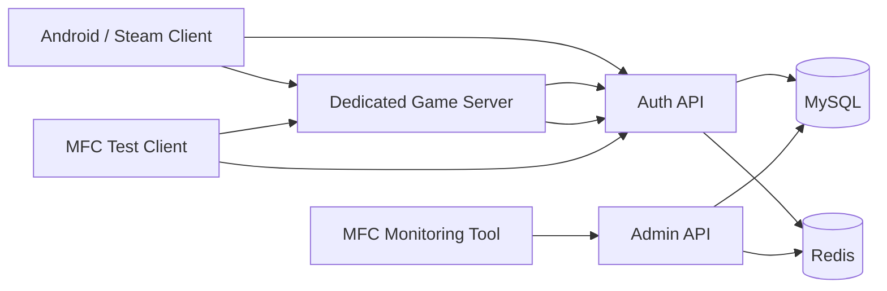

# InfinityServer 구현 로드맵

## 목표
이 프로젝트는 운영 환경에 가까운 구조로 재정리되고 있습니다.

- `클라이언트 -> Auth API`
- `클라이언트 -> 전용 게임 서버`
- `전용 게임 서버 -> Auth/Match API -> MySQL`
- 세션, 리더보드, 매치 캐시를 위한 `Redis`
- 운영 관제를 위한 `MFC 모니터링 도구`
- 프로토콜 및 통합 테스트를 위한 `MFC 테스트 클라이언트`

## 추가된 서버 모듈

### Shared
- `ServiceResult`
- `ServerConfig`
- `Logger`

### Auth
- `LoginProvider`
- `AuthenticatedUser`
- `AuthService`

### Infrastructure
- `RedisCache`
- `UserRepository`
- `MatchRepository`

### Match
- `MatchResultDispatcher`

### Admin
- `AdminMonitoringService`

### TestClient
- `TestScenarioCatalog`

## 현재 구현된 런타임 흐름
- 이제 로컬 회원가입이 패킷 계층을 통해 지원됩니다.
- 로컬 로그인은 `UserRepository`를 통해 `AuthService`가 처리합니다.
- Google 및 Steam 형태의 소셜 로그인이 개발용 시드 토큰으로 지원됩니다.
- 게임 세션 토큰은 `TokenService`가 발급합니다.
- 발급된 게임 세션 토큰은 `RedisCache`의 메모리 기반 세션 저장소에 캐시됩니다.
- 전용 서버 방식의 토큰 검증은 패킷 opcode `0x0004`로 제공됩니다.
- 매치 결과 저장과 사용자별 누적 통계 조회는 패킷 핸들러를 통해 사용할 수 있습니다.

## 기본 제공 개발 계정
- 로컬: `tester@infinity.local / pass1234`
- 로컬: `operator@infinity.local / admin1234`
- Google 토큰: `google / google-dev-token`
- Steam 토큰: `steam / steam-dev-ticket`

## MFC 테스트 클라이언트에서 바로 검증 가능한 패킷 시나리오
- `0x0006` 로컬 계정 회원가입
- `0x0001` 로컬 계정 로그인
- `0x0003` Google 또는 Steam 토큰 로그인
- `0x0004` 게임 세션 토큰 검증
- `0x0008` 매치 결과 제출
- `0x000A` 플레이어 누적 통계 요청

## 이 구조 분리가 더 나은 이유

### 이전 구조
- 네트워크 코드, 패킷 파싱, 로그인 책임, 영속성 관련 관심사가 사실상 한곳에 섞여 있었습니다.
- Google 로그인, Steam 로그인, 모니터링, 대량 결과 저장을 추가하려면 소켓 및 패킷 파일을 직접 수정해야 했습니다.

### 현재 구조
- `Network`는 전송 계층 역할에 집중합니다.
- `Auth`는 사용자 식별과 토큰 흐름을 담당합니다.
- `Infrastructure`는 MySQL, Redis 같은 외부 시스템을 담당합니다.
- `Match`는 서버 권한 기반의 결과 저장을 담당합니다.
- `Admin`은 운영 도구용 모니터링 스냅샷을 담당합니다.
- `TestClient`는 반복 가능한 통합 테스트 시나리오를 담당합니다.

## 구성도

## 다음 구현 단계
1. 현재 메모리 기반 토큰 형식을 JWT 서명 및 리프레시 토큰 영속화 방식으로 교체합니다.
2. 현재 프로세스 내부 `DBConnector` 저장 방식을 MySQL 기반 계정 및 식별 테이블로 교체합니다.
3. 현재 프로세스 내부 Redis 세션 맵을 실제 Redis 클라이언트로 교체합니다.
4. Auth, Match, Admin 엔드포인트용 HTTP API 계층을 추가합니다.
5. 전용 서버만 매치 결과를 제출할 수 있도록 패킷 권한 검사를 추가합니다.
6. 세션, 매치, 오류 조회를 위한 MFC 모니터링 페이지를 구현합니다.
7. 로그인, 재접속, 매치 결과, 통계 회귀 테스트용 MFC 테스트 시나리오를 구현합니다.
